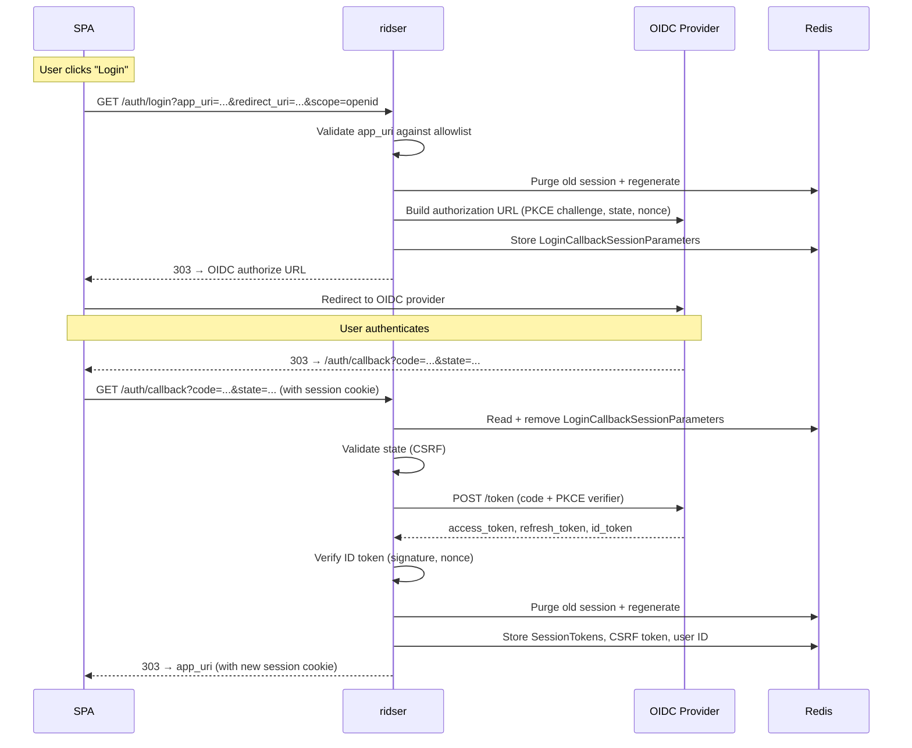
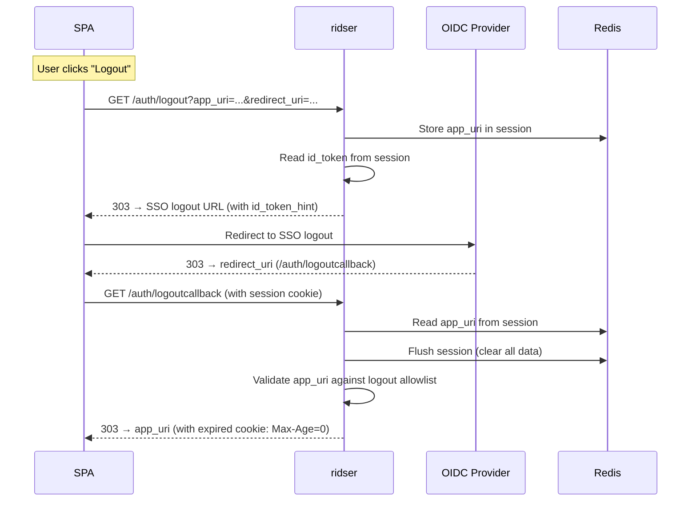
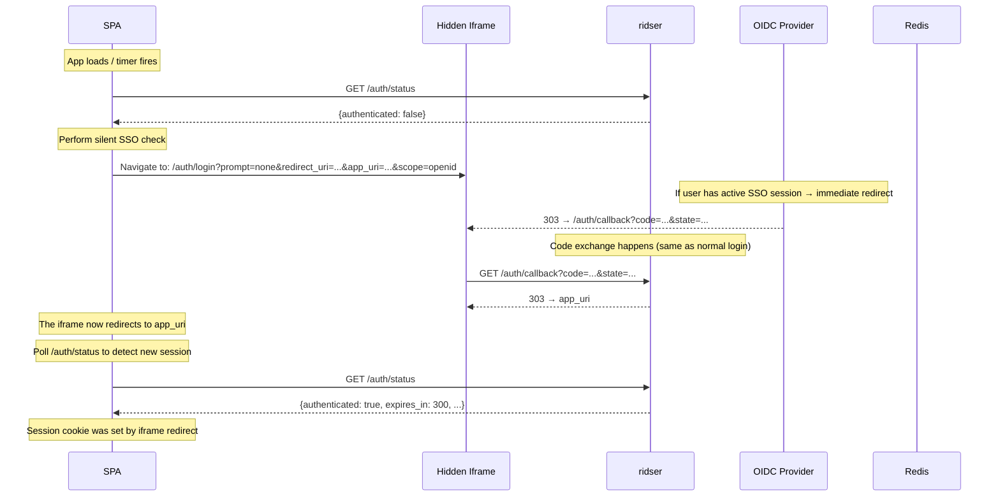

# Auth Frontend Guide — ridser

## Architecture Overview

```
┌──────────────┐       session cookie (ridser.sid)       ┌───────────┐       OIDC       ┌──────────────┐
│   Browser    │ ◄─────────────────────────────────────► │           │ ◄──────────────► │    OIDC      │
│   (SPA)      │                                         │   Rust    │                  │  Provider    │
│              │   ┌─────────────────────────────────┐   │ identity  │                  │  (Keycloak)  │
│              │   │  /api/{*path}  ──► proxy w/ JWT │   │  service  │                  │              │
│              │   │  /auth/*       ──► auth handlers│   │  ridser   │                  └──────────────┘
│              │   └─────────────────────────────────┘   │   (BFF)   │  API calls proxy ┌──────────────┐
└──────────────┘                                         │           │ ◄──────────────► │   Backend    │
                                                         └───────────┘                  └──────────────┘
                                                               ↕
                                                         ┌───────────┐
                                                         │  Redis    │
                                                         │ (session) │
                                                         └───────────┘
```

**ridser** is a BFF (Backend-for-Frontend) service that:

- Manages OIDC authentication against a provider (e.g. Keycloak)
- Stores session data in Redis, identified by an encrypted cookie (`ridser.sid`)
- Proxies `/api/*` requests to backend services with a JWT `Authorization` header
- Enforces CSRF protection on non-GET proxy requests
- Can be integrated with Traefik via ForwardAuth middleware

The SPA never sees the OIDC tokens directly — they live in the session on the server.

---

## Session Details

| Property    | Value                                                                    |
| ----------- | ------------------------------------------------------------------------ |
| Cookie name | `ridser.sid` (configurable via `RIDSER_SESSION_COOKIE_NAME`)             |
| Encrypted   | Yes — AES-256-GCM using `RIDSER_SESSION_SECRET` (64 bytes)               |
| Backend     | Redis                                                                    |
| TTL         | 1 hour inactivity                                                        |
| SameSite    | `None` by default (configurable via `RIDSER_SESSION_COOKIE_SAMESITE`)    |
| Secure      | Enabled by default (disable via `RIDSER_SESSION_SECURE_COOKIE_DISABLED`) |

The SPA must support credentials (session cookie) being sent cross-origin if the SPA is on a different origin than ridser. Configure `SameSite=None; Secure` in production.

---

## Endpoint Reference

### `GET /auth/status` — Session Status

Check whether the current session has valid tokens.

**Request:** No special headers or body.

**Response `200 OK`:**

```json
{
  "authenticated": false,
  "expires_in": null,
  "refresh_expires_in": null
}
```

```json
{
  "authenticated": true,
  "expires_in": 285,
  "refresh_expires_in": 3590
}
```

| Field                | Type             | Description                                                                            |
| -------------------- | ---------------- | -------------------------------------------------------------------------------------- |
| `authenticated`      | `bool`           | Whether valid OIDC tokens exist in the session                                         |
| `expires_in`         | `number \| null` | Seconds until the access token expires. `null` if unauthenticated or already expired.  |
| `refresh_expires_in` | `number \| null` | Seconds until the refresh token expires. `null` if unauthenticated or already expired. |

**Errors:** None — always returns `200 OK`.

**Usage:**

```js
const status = await fetch("/auth/status").then((r) => r.json());
if (status.authenticated) {
  console.log(`Token expires in ${status.expires_in}s`);
}
```

---

### `GET /auth/login` — Initiate Login

Redirect the browser to this endpoint to start the OIDC authorization code flow with PKCE.

**Query Parameters:**

| Parameter      | Required | Description                                                                                                   |
| -------------- | -------- | ------------------------------------------------------------------------------------------------------------- |
| `app_uri`      | **yes**  | URI to redirect back to after successful login. Must be in the `RIDSER_LOGIN_REDIRECT_APP_URIS` allowlist.    |
| `redirect_uri` | **yes**  | The OIDC redirect URI (points to `/auth/callback` on this server). Must be registered with the OIDC provider. |
| `scope`        | **yes**  | OIDC scopes, e.g. `openid` or `openid profile email`                                                          |
| `ui_locales`   | no       | Language hint forwarded to the OIDC provider (e.g. `de`, `en`)                                                |
| `prompt`       | no       | OIDC prompt parameter (e.g. `none` for silent auth, `login` to force re-authentication)                       |
| `kc_idp_hint`  | no       | Keycloak-specific identity provider hint                                                                      |

**Response:** `303 See Other` redirect to the OIDC provider's authorization URL.

**Errors:**

| Status | Body              | Condition                                             |
| ------ | ----------------- | ----------------------------------------------------- |
| `400`  | `Invalid app_uri` | The `app_uri` is not in the allowlist                 |
| `500`  | `Server failure`  | Failed to contact OIDC provider or build the auth URL |

**`app_uri` Allowlist:**

Configured via `RIDSER_LOGIN_REDIRECT_APP_URIS` (comma-separated). Two matching modes:

- **Exact match**: `http://localhost:3000/exampleapp/` — must match exactly
- **Prefix/wildcard match**: `http://localhost:3000/*` — any URI starting with the prefix (trailing `*` removed) is allowed

Example from `.env.default`:

```
RIDSER_LOGIN_REDIRECT_APP_URIS=http://localhost:4800/*,http://localhost:3000/*
```

**Usage** (SPA initiates login):

```js
const params = new URLSearchParams({
  scope: "openid profile email",
  redirect_uri: window.location.origin + "/auth/callback",
  app_uri: window.location.origin + "/exampleapp/",
});
window.location.href = "/auth/login?" + params.toString();
```

---

### `GET /auth/callback` — OIDC Callback

This endpoint is called by the browser after the user authenticates at the OIDC provider. It exchanges the authorization code for tokens and stores them in the session.

The SPA does **not** call this directly — it is the redirect target specified in `redirect_uri` during login.

**Query Parameters** (provided by the OIDC provider):

| Parameter | Description                                      |
| --------- | ------------------------------------------------ |
| `code`    | Authorization code                               |
| `state`   | CSRF state token (validated against the session) |
| `error`   | (optional) Error from the OIDC provider          |

**Response:** `303 See Other` redirect to the `app_uri` that was originally passed to `/auth/login`.

**Errors:**

| Status | Body              | Condition                                                                       |
| ------ | ----------------- | ------------------------------------------------------------------------------- |
| `400`  | `Invalid session` | No login parameters found in session (e.g. callback called without prior login) |
| `400`  | `Invalid request` | `state` parameter does not match the stored CSRF token                          |
| `400`  | `Invalid app_uri` | Failed to parse the stored `app_uri` when forwarding an OIDC error              |
| `401`  | `Login failure`   | Code exchange with OIDC provider failed                                         |
| `500`  | `Invalid session` | Redis error reading session data                                                |

**After successful callback**, ridser also:

- Regenerates the session (new session ID) to prevent session fixation
- Stores tokens in session under `"ridser_jwt"`
- Generates a 24-character CSRF token stored under `"ridser_csrf_token"`
- Stores the user ID under `"ridser_userid"`

---

### `POST /auth/refresh` — Token Refresh

Manually trigger a refresh of the OIDC access token using the stored refresh token.

**Request:** No special headers or body. Session cookie must be sent.

**Response:**

| Status | Body                        | Condition                                                                             |
| ------ | --------------------------- | ------------------------------------------------------------------------------------- |
| `200`  | `"Refresh successful"`      | Token was refreshed successfully                                                      |
| `400`  | `"Refresh too early"`       | Access token still has more than `RIDSER_SESSION_REFRESH_THRESHOLD` seconds remaining |
| `400`  | `"Refresh token missing"`   | No refresh token available in the stored session tokens                               |
| `400`  | `"Failed to refresh token"` | OIDC provider rejected the refresh                                                    |
| `401`  | `"Unauthorized"`            | No user ID or tokens in session                                                       |
| `409`  | `"Refresh pending..."`      | Another refresh is already in progress for this user                                  |

**Refresh Lock:** ridser uses a per-user mutex to prevent concurrent refreshes. If a refresh is already in progress, subsequent requests get `409 Conflict`.

**Usage:**

```js
const res = await fetch("/auth/refresh", { method: "POST" });
if (res.ok) {
  console.log("Token refreshed");
}
```

---

### `POST /auth/csrftoken` — Get CSRF Token

Retrieve the CSRF token required for non-GET requests to `/api/*` and ForwardAuth.

**Request:** Session cookie must be sent. No body.

**Response `200 OK`:**

```json
{
  "token": "aB3dE5gH7jK9lM1nP2rT4vW6xY"
}
```

For unauthenticated sessions, the token is an empty string:

```json
{
  "token": ""
}
```

**Usage:**

```js
const res = await fetch("/auth/csrftoken", { method: "POST" });
const { token } = await res.json();
// Use on subsequent non-GET API calls:
fetch("/api/some-resource", {
  method: "POST",
  headers: { "x-csrf-token": token },
  body: JSON.stringify(data),
});
```

---

### `GET /auth/logout` — Initiate Logout

Start the SSO logout flow.

**Query Parameters:**

| Parameter      | Required | Description                                                                                                                           |
| -------------- | -------- | ------------------------------------------------------------------------------------------------------------------------------------- |
| `app_uri`      | **yes**  | URI to redirect back to after logout completes. Validated against `RIDSER_LOGOUT_REDIRECT_APP_URIS` **at the `logoutcallback` step**. |
| `redirect_uri` | **yes**  | The post-logout redirect URI for the OIDC provider's SSO logout. This is typically `/auth/logoutcallback` on ridser.                  |

**Response:** `303 See Other` redirect to the SSO logout endpoint.

The SSO logout URL is constructed as:

- If ID token available: `{RIDSER_LOGOUT_SSO_URI}?id_token_hint={id_token}&post_logout_redirect_uri={redirect_uri}`
- If no ID token: `{RIDSER_LOGOUT_SSO_URI}?post_logout_redirect_uri={redirect_uri}&client_id={client_id}`

The `app_uri` is stored in the session and consumed by `/auth/logoutcallback`.

---

### `GET /auth/logoutcallback` — Post-Logout Redirect

This endpoint is called by the OIDC provider (or the browser) after SSO logout completes. It clears the session and redirects back to the SPA.

**Behavior:**

1. Reads `app_uri` from session (stored during `/auth/logout`)
2. Flushes the session (clears all data, expires the cookie)
3. Validates `app_uri` against `RIDSER_LOGOUT_REDIRECT_APP_URIS` (exact match only — no wildcards)
4. Redirects to `app_uri`

**Response:** `303 See Other` redirect to the `app_uri`.

**Errors:**

| Status | Body              | Condition                                    |
| ------ | ----------------- | -------------------------------------------- |
| `400`  | `Invalid app_uri` | The `app_uri` is not in the logout allowlist |

**Important:** The logout allowlist only supports **exact matches** (no `*` wildcards). Unlike the login allowlist.

---

### `GET /auth/` — Forward Auth (Traefik Integration)

Used by Traefik's `ForwardAuth` middleware. Not called by the SPA directly.

**Required Header:**

| Header               | Description                                                  |
| -------------------- | ------------------------------------------------------------ |
| `X-Forwarded-Method` | The HTTP method of the original request (e.g. `GET`, `POST`) |

**Behavior:**

- Returns `401` if no valid session
- For non-GET methods, validates `x-csrf-token` header against session
- Strips the session cookie from forwarded headers
- Injects `Authorization: Bearer {access_token}`
- Strips `x-csrf-token` header
- Returns `200 OK` with modified headers that Traefik applies to the upstream request

---

### `/api/{*path}` — Proxy

All methods (GET, POST, PUT, PATCH, DELETE, OPTIONS) on `/api/{*path}` are proxied to the backend target(s).

**CSRF Protection:**

For **non-GET** requests, the SPA must include:

| Header         | Value                                               |
| -------------- | --------------------------------------------------- |
| `x-csrf-token` | The CSRF token obtained from `POST /auth/csrftoken` |

If missing or invalid, the proxy returns `403 Forbidden`.

**Proxy Behavior:**

- Strips the session cookie from the forwarded request
- Preserves all other cookies
- Injects `Authorization: Bearer {access_token}` (if authenticated)
- Removes `x-csrf-token` header before forwarding
- Routes based on `RIDSER_PROXY_TARGET` and `RIDSER_PROXY_TARGET_RULE_<name>`

**Usage:**

```js
// GET request (no CSRF needed)
fetch("/api/users");

// POST request (CSRF required)
const { token } = await fetch("/auth/csrftoken", { method: "POST" }).then((r) =>
  r.json(),
);
fetch("/api/users", {
  method: "POST",
  headers: { "x-csrf-token": token },
  body: JSON.stringify({ name: "Alice" }),
});
```

---

## Auth Flow Sequences

### Login Flow



### Logout Flow



### Silent SSO Check Flow



---

## Silent SSO Check (iframe)

To detect an existing SSO session without redirecting the page, use a hidden iframe with `prompt=none`:

**Implementation steps:**

1. Create a hidden iframe:

```html
<iframe id="sso-iframe" style="display:none"></iframe>
```

2. Point the iframe to the login endpoint with `prompt=none`:

```js
function checkSilentSSO() {
  const callbackUrl = window.location.origin + "/auth/callback";
  const appUri = window.location.origin + "/auth-demo/";
  const loginUrl = `/auth/login?scope=openid&redirect_uri=${encodeURIComponent(callbackUrl)}&app_uri=${encodeURIComponent(appUri)}&prompt=none`;

  const iframe = document.getElementById("sso-iframe");
  iframe.src = loginUrl;
}
```

3. Poll `/auth/status` to detect the session being established:

```js
function waitForSession() {
  return new Promise((resolve) => {
    const check = async () => {
      const status = await fetch("/auth/status").then((r) => r.json());
      if (status.authenticated) resolve(status);
      else setTimeout(check, 500);
    };
    check();
  });
}
```

**How it works:**

- `prompt=none` tells the OIDC provider to not show any UI — if there's an active SSO session, it immediately returns the authorization code
- The iframe follows the redirect to `/auth/callback`, which exchanges the code and stores tokens in the session
- The browser automatically attaches the session cookie to the iframe requests (same-origin)
- The session cookie set by the callback redirect response is stored in the browser
- The SPA (on the same origin) can now use this session

**Important considerations:**

- The `prompt=none` flow requires the iframe's origin to match ridser's origin (same-site/same-origin policy for cookies)
- If the OIDC provider does not support `prompt=none`, the iframe may redirect to a login page instead — detect this by checking if the iframe's URL changes unexpectedly
- If `SameSite=None` is configured, the iframe approach works cross-origin as long as the browser supports third-party cookies
- Some browsers block third-party cookies in iframes — use the `SameSite=None; Secure` configuration and consider using a same-origin reverse proxy setup

---

## CSRF Token Lifecycle

1. **Generated** during the OIDC callback — a 24-character random alphanumeric string is stored in the session
2. **Retrieved** by the SPA via `POST /auth/csrftoken`
3. **Sent** as `x-csrf-token` header on every non-GET request to `/api/*` or through ForwardAuth
4. **Validated** by ridser on the server side against the stored value
5. **Persists** for the duration of the session (replaced only on re-login)

The SPA should fetch the CSRF token early (e.g. right after detecting an authenticated session) and cache it in memory.

---

## Token Refresh Strategy

ridser provides a manual refresh endpoint (`POST /auth/refresh`). The SPA should:

1. **Monitor** access token expiry via `/auth/status` → `expires_in`
2. **Trigger refresh** when `expires_in` drops below `RIDSER_SESSION_REFRESH_THRESHOLD` (default 15 seconds)
3. **Handle concurrent refreshes**: The `409 Conflict` response indicates a refresh is already in progress
4. **Handle refresh failure**: If the refresh token is expired (`400 Failed to refresh token`), redirect the user to re-authenticate

**Recommended implementation:**

```js
let refreshInterval;

async function startRefreshMonitor() {
  const status = await fetch("/auth/status").then((r) => r.json());
  if (!status.authenticated || status.refresh_expires_in === null) return;

  // Schedule refresh when token is close to expiry
  if (status.expires_in < 30) {
    await fetch("/auth/refresh", { method: "POST" });
  }

  // Poll periodically
  refreshInterval = setInterval(async () => {
    const s = await fetch("/auth/status").then((r) => r.json());
    if (s.expires_in !== null && s.expires_in < 15) {
      const res = await fetch("/auth/refresh", { method: "POST" });
      if (!res.ok && res.status !== 409) {
        // Refresh failed — redirect to login
        clearInterval(refreshInterval);
        initiateLogin();
      }
    }
  }, 10000);
}
```

---

## Error Handling Reference

| Endpoint               | Status | Error Condition                                  |
| ---------------------- | ------ | ------------------------------------------------ |
| `/auth/login`          | `400`  | `app_uri` not in allowlist                       |
| `/auth/login`          | `500`  | Failed to build authorization URL                |
| `/auth/callback`       | `400`  | Missing/invalid session parameters               |
| `/auth/callback`       | `400`  | Invalid state (CSRF mismatch)                    |
| `/auth/callback`       | `401`  | Code exchange with OIDC provider failed          |
| `/auth/callback`       | `500`  | Redis error                                      |
| `/auth/refresh`        | `400`  | Refresh too early                                |
| `/auth/refresh`        | `400`  | No refresh token available                       |
| `/auth/refresh`        | `400`  | Token refresh rejected by provider               |
| `/auth/refresh`        | `401`  | No user ID or tokens in session                  |
| `/auth/refresh`        | `409`  | Another refresh already in progress              |
| `/auth/csrftoken`      | `200`  | Always succeeds (empty token if unauthenticated) |
| `/auth/logout`         | `303`  | Always redirects (no validation errors)          |
| `/auth/logoutcallback` | `400`  | `app_uri` not in logout allowlist                |
| `/auth/` (ForwardAuth) | `400`  | Missing `X-Forwarded-Method` header              |
| `/auth/` (ForwardAuth) | `401`  | No session                                       |
| `/auth/` (ForwardAuth) | `403`  | CSRF token missing/invalid (non-GET)             |
| `/api/{*path}`         | `403`  | CSRF token missing/invalid (non-GET)             |
| `/api/{*path}`         | `400`  | Invalid proxy URI configuration                  |
| `/api/{*path}`         | `500`  | Proxy request failed                             |

---

## Environment Configuration Reference

Key environment variables that affect the frontend integration:

| Variable                                | Purpose                                     | Effect on SPA                                                      |
| --------------------------------------- | ------------------------------------------- | ------------------------------------------------------------------ |
| `RIDSER_SESSION_COOKIE_NAME`            | Session cookie name (default: `ridser.sid`) | Not directly visible to SPA, but affects cookie handling           |
| `RIDSER_SESSION_COOKIE_SAMESITE`        | SameSite attribute (default: `None`)        | Must be `None` for cross-origin; `Lax` or `Strict` for same-origin |
| `RIDSER_LOGIN_REDIRECT_APP_URIS`        | Allowed post-login redirect URIs            | SPA must pass an `app_uri` that matches this list                  |
| `RIDSER_LOGOUT_REDIRECT_APP_URIS`       | Allowed post-logout redirect URIs           | SPA must pass an `app_uri` that exactly matches this list          |
| `RIDSER_LOGOUT_SSO_URI`                 | SSO logout endpoint URL                     | Determines where the browser is redirected for SSO logout          |
| `RIDSER_SESSION_REFRESH_THRESHOLD`      | Min remaining seconds to allow refresh      | SPA should wait until `expires_in` drops below this value          |
| `RIDSER_SESSION_SECURE_COOKIE_DISABLED` | Disable Secure flag on cookie               | If set, cookies work over HTTP (dev only)                          |

---

## Key Implementation Rules (for AI Agents)

1. **Always send credentials (cookies)** with `fetch` by using `credentials: "include"` or relying on same-origin requests
2. **CSRF is required** for all non-GET requests to `/api/*` — fetch it once via `POST /auth/csrftoken`, cache it in memory
3. **`app_uri` must be allowlisted** — the SPA must know which URIs are configured on the server
4. **Logout callback** is a two-step process: `/auth/logout` initiates SSO logout, `/auth/logoutcallback` completes it
5. **Session regeneration** happens on login and callback — the session cookie changes, and old session data is purged from Redis
6. **`prompt=none`** is the mechanism for silent SSO checks via iframe — requires `SameSite=None` cookies or same-origin deployment
7. **The OIDC `redirect_uri`** must match what's registered at the OIDC provider — typically `{origin}/auth/callback`
8. **The `state` parameter** in `/auth/login` is an OIDC-level CSRF state managed by ridser; the SPA may additionally manage its own app-level state using `sessionStorage`
